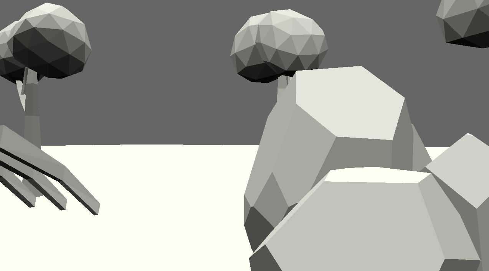

# Hide & Seek

Author: Ziyu Li

Design: I did not finish this game (sad pikahu face). It is supposed to be like my blind sound wave game but played with 2 players, where they can see each other only via footsteps, and you can use spacebar to catch the other plater.

Screen Shot:

How To Play:

WASD to move.

This game was built with [NEST](NEST.md).

